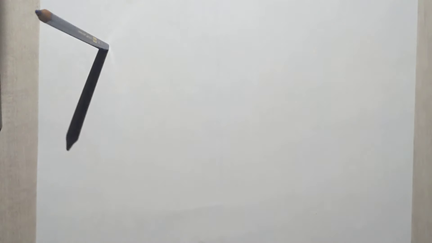
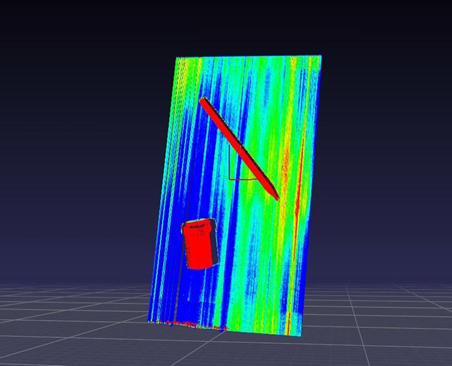
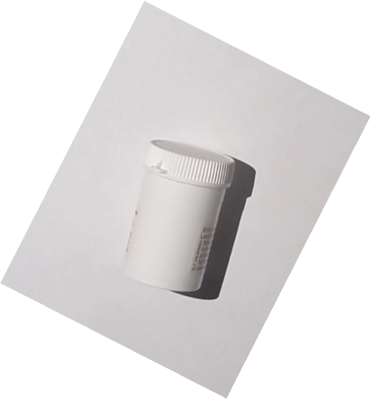

# 3D Photography on Your Desk

A Python implementation of the paper "3D photography on your desk" that reconstructs 3D scenes from a single non-moving camera using shadow-based projective geometry.

**Authors:** Ohad Klein, Aviel Raclaw  
**Based on:** [3D photography on your desk paper](https://www-labs.iro.umontreal.ca/~roys/predoc/3dphotography.pdf)

📊 **For detailed mathematical explanations and deeper project insights, see our presentation:** [`v3d final project.pptx`](v3d%20final%20project.pptx)

## Overview

This project aims to reconstruct a 3D scene from a degenerate 2D setup, taken from a single non-moving camera. Using shadows cast on the scene and projective geometry, we can find the 3D location of each pixel in the image with respect to a predefined coordinate system.

At each frame, a pencil casts a straight shadow line on the scene, which bends in correspondence to object height. This method provides temporal information regarding each pixel, allowing us to construct the 3D scene.


## How It Works

The 3D location of each pixel on the shadow line is computed as the intersection between:
- A line determined by the camera center and the pixel's projection on the floor plane
- A plane determined by two points on both edges of the shadow line and the light source location

## Project Structure

### Core Files

- **`main.py`** - Main driver script that orchestrates the entire 3D reconstruction process
- **`ext_calib.py`** - Camera calibration module using SVD to find camera matrix and center
- **`get_shadow_edges.py`** - Detects shadow edges (left and right points) for each frame
- **`get_ts.py`** - Calculates shadow time for each pixel (first frame when pixel enters shadow)
- **`lamp.py`** - Light source coordinate detection using pencil shadows
- **`triangulation.py`** - Core 3D reconstruction logic using line-plane intersection
- **`utils.py`** - Utility functions for mathematical operations
- **`plot_scene3d.py`** - Visualization tool for generated 3D scenes

### Configuration

- **`example_run/conf.py`** - Configuration file containing all parameters that need to be set manually
- **`example_run/calib_params/`** - Camera calibration parameters and pencil images
- **`example_run/scan_frames/`** - Video frames for 3D reconstruction
- **`example_run/scan_params/`** - Generated 3D scene data

## Setup Instructions

### 1. Prerequisites

Install required Python packages:
```bash
pip install numpy scipy opencv-python tqdm matplotlib
```

### 2. Configuration Setup

You need to modify the parameters in `example_run/conf.py` or create your own configuration file:

#### Required Parameters:

- **`points_3D`** - 3D coordinates of calibration points (6 points minimum)
- **`points_2D`** - Corresponding 2D pixel coordinates of calibration points
- **`pencil_bases_2d`** - 2D coordinates of pencil bases from calibration images
- **`pencil_shadow_tips_2d`** - 2D coordinates of pencil shadow tips from calibration images
- **`pencil_height`** - Height of pencil in coordinate system units
- **`video_directory`** - Directory containing your scanning videos

### 3. Camera Calibration Setup

1. **Set up a clean white background** to avoid noise
2. **Place two checkerboards perpendicular to each other** as shown:


3. **Choose 6 independent points** on the checkerboards and match their 3D coordinates to 2D pixel coordinates
4. **Use SVD for extrinsic camera calibration** to get the camera matrix
5. **Extract camera center** as the null space of the camera matrix

### 4. Light Source Setup

1. **Take at least 2 photos** of a pencil of known length standing in different locations:




2. **Extract pencil base and shadow tip coordinates** from these images
3. **Calculate light source 3D coordinates** using the pencil geometry

### 5. Scene Capture

1. **Place object for scanning** in front of the camera
2. **Film while slowly moving a pencil-like object** across the light source, creating a moving shadow:

https://github.com/user-attachments/assets/1c49a74f-5b52-4437-8f15-c5890c38e590

3. **Ensure good lighting conditions** - bright background and objects work best

## Usage

### Basic Usage

1. **Configure your parameters** in `conf.py` (or create your own config file)
2. **Run the main script:**
   ```bash
   python main.py
   ```
3. **Visualize results** using:
   ```bash
   python plot_scene3d.py
   ```

### What the Script Does

The `main.py` script performs these steps in sequence:

1. **Camera Calibration** - Finds camera matrix and center using calibration points
2. **Light Source Detection** - Calculates 3D light source coordinates using pencil shadows
3. **Shadow Time Calculation** - Determines when each pixel first enters shadow
4. **Shadow Edge Detection** - Finds left and right edges of shadow lines for each frame
5. **3D Reconstruction** - Computes 3D coordinates for each pixel using triangulation

## Results

### Example Reconstructions

<div align="center">
  
  
</div>

### Input vs Output Comparison

#### Example 1: Basic Object Reconstruction

<div align="center">
  <table>
    <tr>
      <td align="center"><b>Input Scene</b></td>
      <td align="center"><b>3D Output</b></td>
    </tr>
    <tr>
      <td></td>
      <td></td>
    </tr>
    <tr>
      <td></td>
      <td></td>
    </tr>
  </table>
</div>

#### Example 2: Complex Object Reconstruction

<div align="center">
  <table>
    <tr>
      <td align="center"><b>Input Scene</b></td>
      <td align="center"><b>3D Output</b></td>
    </tr>
    <tr>
      <td></td>
      <td></td>
    </tr>
    <tr>
      <td></td>
      <td></td>
    </tr>
  </table>
</div>

### Height Sensitivity Analysis

The algorithm demonstrates high sensitivity to height differences, as shown in the pill box reconstruction:

<div align="center">
  
  
</div>

## Limitations

The algorithm may fail to generate good 3D scenes when:

- **Background is not bright enough** or has darker areas
- **Scanned items are not bright enough** or have darker areas


## Future Improvements

- **Increase image contrast** to make light pixels lighter and dark pixels darker
- **Adjust threshold values** for more/less sensitive shadow detection
- **Create scan ensembles** by running multiple scans from different shadow angles and averaging results

## File Descriptions

### Core Algorithm Files

- **`ext_calib.py`** - Performs camera calibration using SVD to find camera matrix and center coordinates
- **`lamp.py`** - Calculates 3D light source coordinates using pencil shadow geometry
- **`get_ts.py`** - Computes shadow time for each pixel (first frame when pixel enters shadow)
- **`get_shadow_edges.py`** - Detects left and right edges of shadow lines for each frame
- **`triangulation.py`** - Core 3D reconstruction using line-plane intersection mathematics
- **`utils.py`** - Mathematical utility functions for coordinate transformations and plane equations

### Configuration and Data

- **`example_run/conf.py`** - All configuration parameters that must be set manually
- **`example_run/calib_params/`** - Camera calibration data and pencil images
- **`example_run/scan_frames/`** - Video frames for 3D reconstruction
- **`example_run/scan_params/`** - Generated 3D scene point clouds

## Technical Details

The algorithm works by:

1. **Camera Calibration**: Using known 3D-2D point correspondences to find camera parameters
2. **Light Source Detection**: Using pencil shadows to triangulate light source position
3. **Shadow Time Detection**: Finding when each pixel first enters shadow using frame differencing
4. **Edge Detection**: Locating shadow line edges for each frame
5. **3D Triangulation**: Computing 3D coordinates by intersecting camera rays with shadow planes

The mathematical foundation relies on projective geometry, where each pixel's 3D location is found by intersecting:
- A line from camera center through the pixel's floor projection
- A plane defined by shadow line edges and the light source

## Contributing

This project implements the research paper "3D photography on your desk". For improvements or modifications, please refer to the original paper and ensure proper attribution.

## License

This implementation is for educational and research purposes. Please cite the original paper when using this code.
